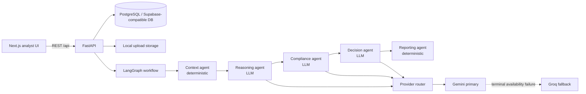
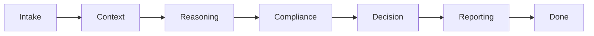
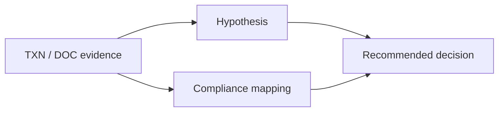

# Holla — AI-Powered Fraud Investigation Copilot

Holla is an investigation-support application that turns mock-bank alerts, transactions, and supporting documents into an evidence-aware fraud investigation record: deterministic context, competing hypotheses, compliance findings, decision options, and a final report.

It is built for hackathon demonstration and analyst decision support—not autonomous fraud adjudication, legal advice, or a production banking control.

## Problem statement

Modern fraud investigations are rarely a single suspicious payment. An analyst must connect fragmented transaction data with customer context, counterparties, documents, anomaly patterns, jurisdictions, and possible compliance concerns—then explain why a proposed action is justified. That work is time-consuming, evidence-sensitive, and vulnerable to gaps in context.

Holla provides a single investigation workflow that preserves the case evidence and makes intermediate reasoning visible rather than returning an unexplained fraud label.

## What we built

- A five-stage LangGraph investigation workflow.
- Deterministic context and anomaly analysis for transaction patterns and historical mock-bank baselines.
- LLM-assisted competing-hypothesis, compliance, and decision stages.
- Evidence references, anomaly IDs, evidence gaps, confidence/risk scores, and report provenance.
- A FastAPI backend with persisted investigation state and document handling.
- A Next.js officer dashboard and investigation-detail view.
- A deterministic report builder that emits relationship, reasoning, decision-comparison, and timeline graph payloads.

## Key features

| Feature | Status | What it does |
| --- | --- | --- |
| Mock-bank investigation intake | Implemented | Creates deterministic seeded scenarios or builds a case from persisted mock-bank accounts. |
| Context and anomaly analysis | Implemented | Detects large and rapid transactions, calculates a contextual risk score, and can compare the case with mock-bank history. |
| Document evidence | Implemented | Extracts PDF text; uses Gemini Vision OCR for image/scanned-PDF fallback; extracts simple entities/transactions deterministically. |
| Competing hypotheses | Implemented | Produces at least two structured hypotheses with supporting and contradicting evidence. |
| Evidence-backed compliance review | Implemented | Produces normalized compliance mappings, evidence references, and evidence gaps. |
| Decision options | Implemented | Produces `ALLOW`, `HOLD`, `BLOCK`, and `ESCALATE` options plus one recommendation and rationale. |
| Explainable report | Implemented | Builds a deterministic narrative and graph payloads from upstream state without another LLM request. |
| Gemini → Groq resilience | Implemented | Uses Gemini as primary and makes a one-way Groq handoff only after terminal rate-limit, timeout, or transient provider failures. |
| Authentication/authorization | **Planned** | The current API is unauthenticated. |

## System architecture



The backend persists investigation state after completed workflow nodes. The frontend creates/runs cases, polls their state, displays Context/Reasoning/Compliance/Decision panels, uploads documents, and offers the generated Markdown report for download.

## Agent architecture

| Agent | Input | Processing | Output |
| --- | --- | --- | --- |
| Context & Evidence Intelligence | Case input, documents, mock-bank history | Deterministic transaction statistics, large/rapid transfer detection, historical deviation checks, document evidence summaries | Context summary, indicators, anomalies, baseline, risk score |
| Investigation Reasoning | Case + context | Structured LLM hypothesis generation; evidence normalization; sparse-evidence confidence cap; grounding checks | Competing hypotheses, confidence, supporting/contradicting evidence, suggested actions |
| Evidence & Compliance Validation | Case + context + reasoning | Structured LLM compliance analysis; evidence-reference normalization and gap detection | Compliance mappings, violation status, severity, evidence gaps |
| Decision Optimization | Case + context + reasoning + compliance | Structured LLM comparison of the four action options | Options, recommended action, rationale, risks, mitigations |
| Reporting & Visualization | Full investigation state | Deterministic synthesis and graph construction | Executive summary, Markdown narrative, graph/timeline payloads |

Agents exchange information only through the shared `InvestigationState`; there is no separate agent-to-agent side channel. The graph order is fixed:



If a graph node raises an exception during the persistent workflow, the backend records an `AgentError`, persists partial state, marks the affected stage failed, and stops downstream execution.

## Investigation workflow

1. A mock-bank alert/account is selected, or a deterministic mock scenario is created.
2. Transactions, customer context, and any supporting documents enter the `CaseInput`.
3. The Context agent computes indicators, anomaly IDs, risk score, and—when available—a historical baseline.
4. The Reasoning agent generates competing explanations tied to evidence.
5. The Compliance agent maps findings to supplied evidence and explicitly lists evidence gaps.
6. The Decision agent evaluates all four supported actions and recommends one.
7. The Reporting agent creates the final narrative and provenance/relationship graph data.

## AI and model architecture

### Deterministic vs. model-assisted work

- **Deterministic:** context/anomaly analysis, document summary truncation and simple extraction, evidence normalization, report assembly, graph payload construction, workflow persistence.
- **LLM-assisted:** reasoning, compliance analysis, and decision generation.

### Provider routing

`get_reasoning_client()` is the shared provider boundary used by all three LLM stages.

- **Primary:** Gemini, configured by `LLM_PRIMARY_PROVIDER=gemini` and `GEMINI_MODEL`.
- **Fallback:** Groq, configured by `LLM_FALLBACK_PROVIDER=groq`; the supplied default is `openai/gpt-oss-20b`.
- **Handoff:** Gemini gets its bounded transport retry policy first. Only terminal `GeminiRateLimitError`, `GeminiTimeoutError`, or `GeminiTransientError` can trigger one Groq handoff. Groq never routes back to Gemini.
- **Compatibility:** the legacy `REASONING_LLM_PROVIDER=ollama` selection remains supported for existing Ollama deployments.

Normal successful runs make one provider call for each LLM stage: **three calls total**. Model output remains subject to Pydantic parsing and the agents’ downstream validation regardless of provider.

## Security architecture

Holla includes meaningful validation and fail-safe behavior, but it is **not production-hardened**. The following table distinguishes implementation from limitations.

| Area | Implemented controls | Current limitation |
| --- | --- | --- |
| Secrets | API keys and database connection settings are read through Pydantic settings from `backend/.env`; client error helpers redact key-like values. | Repository-level `.gitignore` protection for local `.env` files was not found during this review. Do not commit `.env`; add explicit ignore rules before shared deployment. |
| Input validation | Pydantic schemas validate typed case state; FastAPI validates paths, queries, and multipart form fields; case IDs are constrained. | Mock-bank customer/account endpoint identifiers only use minimal non-empty validation. |
| Upload handling | PDF/image-only processing routes; document service rejects inputs over 10 MiB before parsing/OCR. | Files are written to local disk; there is no malware scanning, content-type verification, object storage, or per-user access control. |
| LLM output | Structured response schemas, bounded correction attempts, decision-option validation, evidence normalization, and reasoning grounding checks. | LLM output cannot guarantee factual correctness; human review remains required. |
| Grounding | Hypotheses are checked for unavailable data categories and invented evidence identifiers; unsupported evidence is removed. Compliance mappings are normalized against available identifiers. | Generic natural-language claims still need analyst review; this is not a formal proof system. |
| Prompt injection | Prompts constrain JSON output and tell models to use supplied evidence; compact prompts limit unnecessary fields. | No dedicated prompt-injection classifier, trusted/untrusted content boundary, or adversarial-document sanitization is implemented. Uploaded text can reach model prompts. |
| Provider resilience | Bounded retries, retry-delay handling, one-way Gemini → Groq fallback, and no provider bounce loop. | No shared project-wide request limiter; the API itself has no client/IP rate limiter. |
| Error handling/audit trail | Safe API error envelope; node failures persist `AgentError` plus partial state; provider logs omit prompts, raw responses, and keys. | Normal application logs may still require production redaction/retention controls for PII-bearing identifiers. |
| CORS | CORS middleware is configured for frontend interoperability. | It currently permits all origins with credentials—unsafe for a public production deployment. Restrict allowed origins before deployment. |
| Authentication | None. | Every API route is currently unauthenticated and authorization is not implemented. Do not expose this API to untrusted networks. |
| Tool access | The investigation LLM calls do not expose application tools/function calls. | Provider SDKs and OCR still process data externally according to the configured provider. |

## Threat model

| Threat | Current mitigation | Remaining risk / required production work |
| --- | --- | --- |
| Prompt injection in transaction/document text | Structured prompts, Pydantic output validation, evidence normalization, and grounding checks reduce unsafe output acceptance. | Add trusted-content delimiters, injection detection, and adversarial evaluation. |
| Malicious/untrusted uploads | File size cap and limited PDF/image handling. | Add MIME/content inspection, AV scanning, quarantine, storage isolation, and quotas. |
| Credential leakage | Environment-based configuration and error redaction helpers. | Add `.env` ignore rules, secret manager integration, rotation, and CI secret scanning. |
| Unauthorized access | None. | Add authentication, RBAC/ABAC, tenant boundaries, and audit logs before real customer data. |
| LLM hallucination | Structured schemas, grounding/evidence checks, evidence gaps, competing hypotheses, and deterministic reporting. | Require analyst review; validate provider/model changes with scenario and adversarial tests. |
| Incorrect decision | Four action options, confidence/risk fields, compliance findings, and a visible report support review. | No approval workflow or policy enforcement currently prevents acting on a model recommendation. |
| Provider outage/quota exhaustion | Bounded retries and one-way Groq fallback for terminal availability failures. | Add global quota awareness, metrics, alerts, and operational runbooks. |
| Log/data leakage | API errors avoid returning unexpected exception details; provider telemetry avoids prompts/raw responses. | Define PII log policy, redaction, retention, and monitoring controls. |

## Data security and privacy

Case data can include transactions, account/customer identifiers, optional contact details, device metadata, beneficiary/merchant information, document text, and extracted document data. It is processed by the backend, persisted as investigation state/documents, and portions are sent to configured LLM providers for the three reasoning stages. Image/scanned-PDF OCR is a separate Gemini Vision path.

For local development, keep `backend/.env`, database credentials, provider keys, raw uploads, and any production-like data out of Git. Use synthetic/mock data for demos. Before handling real financial or personal data, add authentication, encryption and retention policies, least-privilege database roles, managed secret storage, constrained CORS, secure object storage, vendor/privacy review, and data-subject/incident procedures.

## Evidence and explainability

Holla’s report does not invent a new conclusion after the decision stage. It reproduces upstream material, including:

- transaction IDs and document IDs;
- anomaly IDs and related transactions;
- hypothesis IDs, confidence, supporting evidence, and contradicting evidence;
- compliance regulation IDs, severity, evidence references, and evidence gaps;
- all decision options, risks, mitigations, selected recommendation, and rationale.

The report also provides graph payloads for evidence → hypothesis → compliance → decision provenance. Missing evidence is represented as an evidence gap, not silently converted into a confirmed violation. Analysts should use this information to review or escalate cases.

## Compliance capability

The compliance stage is an evidence-constrained AML/KYC investigation assistant. It asks the model to identify concerns and map them to supplied evidence, while requiring a violation only where evidence establishes it. The code uses case-specific regulation identifiers/names returned through the structured `ComplianceMapping` model; it does **not** embed a complete legal/regulatory rulebook or certify legal compliance.

Holla is decision support only. Qualified compliance and legal professionals remain responsible for policy interpretation, SAR/STR decisions, customer action, and regulatory filings.

## Graph and network intelligence

The deterministic reporting agent emits three graph payloads:

- **Entity graph:** customer, merchant, beneficiary, and device nodes with associations such as `ASSOCIATED_WITH` and `USED_DEVICE`.
- **Reasoning graph:** evidence references linked to hypotheses, compliance mappings, and the selected decision.
- **Decision graph:** all four actions, with the recommendation marked as preferred over alternatives.



This is report-level graph construction, not a graph database or advanced network-analytics engine. The current frontend consumes report text; dedicated interactive graph visualization is **planned**.

## Sample investigation

The Officer Inbox uses seeded Mock Bank accounts, including a high-risk activity scenario. A representative run follows this shape:

| Stage | Example output |
| --- | --- |
| Alert | Suspicious activity in recent mock-bank transactions. |
| Context | Large and/or rapid transaction anomalies with IDs such as `ANOM-001`; a contextual risk score. |
| Reasoning | Competing suspicious-activity and potentially legitimate explanations, each with evidence lists. |
| Compliance | Evidence-backed review, severity, and explicit gaps where proof is unavailable. |
| Decision | `ALLOW`, `HOLD`, `BLOCK`, and `ESCALATE` options, with one recommendation. |
| Report | Consolidated evidence/provenance narrative and graph data. |

Exact conclusions vary with scenario data and configured model output; mock cases are not real fraud determinations.

## Tech stack

| Layer | Technology |
| --- | --- |
| Backend API | Python, FastAPI, Uvicorn, Pydantic / pydantic-settings |
| Workflow | LangGraph |
| Data | SQLAlchemy async ORM, Alembic, asyncpg; PostgreSQL/Supabase-compatible database; SQLite test support |
| LLM providers | `google-genai` (Gemini), `groq` (Groq fallback), optional Ollama client |
| Document processing | pypdf, Pillow, Gemini Vision OCR fallback |
| Frontend | Next.js 16, React 19, TypeScript, Tailwind CSS, TanStack Query, Axios, Lucide |
| Tests | pytest, pytest-asyncio, Jest, Testing Library |

## Project structure

```text
Holla/
├── backend/
│   ├── app/
│   │   ├── agents/          # Context, reasoning, compliance, decision, reporting
│   │   ├── api/routes/      # Health, investigations, documents, mock-bank REST routes
│   │   ├── core/            # Environment-backed settings
│   │   ├── db/, models/     # Async SQLAlchemy session, repositories, persisted records
│   │   ├── graph/           # LangGraph builder, node adapters, workflow persistence
│   │   ├── mock_bank/       # Deterministic synthetic bank data/scenarios
│   │   ├── schemas/         # Shared Pydantic investigation contract
│   │   └── services/        # LLM clients/router, OCR, extraction, investigation services
│   ├── alembic/             # Database migrations
│   ├── scripts/             # Demo, benchmark, and mock-bank seed helpers
│   └── tests/               # Unit, API, workflow, and E2E-oriented tests
├── frontend/
│   ├── app/                 # Next.js pages and route UI
│   ├── components/          # Analyst panels, report viewer, officer dashboard
│   ├── services/            # Backend API clients
│   └── types/               # Frontend mirror of investigation contracts
├── DEPLOYMENT.md
└── README_API.md
```

## Installation and setup

### Prerequisites

- Python 3.10+
- Node.js 18+
- PostgreSQL 14+ (or a compatible Supabase PostgreSQL database)

### Backend

```bash
git clone <repository-url>
cd Holla/backend

python -m venv .venv
# Windows PowerShell
.venv\Scripts\Activate.ps1
# macOS/Linux: source .venv/bin/activate

pip install -r requirements.txt
Copy-Item .env.example .env  # macOS/Linux: cp .env.example .env

alembic upgrade head
uvicorn app.main:app --reload
```

The API is available at `http://127.0.0.1:8000`, with OpenAPI documentation at `/docs`.

### Frontend

```bash
cd Holla/frontend
npm install
npm run dev
```

The UI defaults to `http://127.0.0.1:3000` and targets `http://127.0.0.1:8000/api` unless `NEXT_PUBLIC_API_URL` is set.

### Configuration

Create `backend/.env` from `backend/.env.example`; use placeholders, never real keys in source control.

| Variable | Purpose |
| --- | --- |
| `DATABASE_URL` | Async SQLAlchemy connection string. |
| `GEMINI_API_KEY`, `GEMINI_MODEL` | Gemini primary credentials/model. |
| `LLM_PRIMARY_PROVIDER` | Primary router selection; normally `gemini`. |
| `LLM_FALLBACK_PROVIDER` | Set `groq` for one-way availability fallback, or `none` to disable it. |
| `GROQ_API_KEY`, `GROQ_MODEL` | Groq fallback credentials/model. |
| `GEMINI_*_RETRIES`, `GROQ_*_RETRIES` | Bounded provider retry/backoff settings. |
| `REASONING_LLM_PROVIDER` | Legacy provider selector; supports existing Ollama deployments. |
| `NEXT_PUBLIC_API_URL` | Optional frontend API base URL. |

Do not set both providers to run concurrently: the router is intentionally sequential.

## Testing

Backend tests cover agents, grounding/evidence regression cases, provider fallback behavior, API validation, document processing, workflow persistence/failures, reporting, and mock-bank scenarios. Frontend tests cover UI components/pages.

```bash
# Backend: from backend/
python -m pytest app/agents/tests/ -v --tb=short
python -m pytest . -x -v --tb=short --ignore=test_ollama_speed.py --ignore=test_ollama_short.py

# Frontend: from frontend/
npm run test
```

Tests mock provider boundaries; they do not require or make real Gemini/Groq calls.

## API and usage

All backend routes are prefixed with `/api`.

| Method | Endpoint | Purpose |
| --- | --- | --- |
| `GET` | `/health` | Health response. |
| `POST` | `/investigations` | Create a deterministic mock case; accepts optional `scenario`/`account_id`. |
| `GET` | `/investigations` | List persisted investigations. |
| `GET` | `/investigations/{case_id}` | Retrieve/poll investigation state. |
| `POST` | `/investigations/{case_id}/run` | Schedule workflow execution; returns `202`. |
| `POST` | `/investigations/{case_id}/documents` | Upload supporting PDF/image documents. |
| `GET` | `/investigations/{case_id}/documents` | List case documents. |
| `GET` | `/investigations/{case_id}/report/download` | Download the Markdown report after completion. |
| `GET` | `/mock-bank/customers/{customer_id}` | Read synthetic customer data. |
| `GET` | `/mock-bank/accounts/{account_id}` | Read synthetic account data. |
| `GET` | `/mock-bank/accounts/{account_id}/transactions` | Read synthetic account transactions. |

Quick API flow:

```bash
curl -X POST "http://127.0.0.1:8000/api/investigations?scenario=high-risk"
curl -X POST "http://127.0.0.1:8000/api/investigations/CASE-2025-00042-HIGH-RISK/run"
curl "http://127.0.0.1:8000/api/investigations/CASE-2025-00042-HIGH-RISK"
```

See [README_API.md](README_API.md) for fuller endpoint/error-envelope documentation.

## Limitations

- The system uses synthetic Mock Bank data and deterministic scenarios for demos.
- APIs are unauthenticated and CORS is permissive; this is unsuitable for public deployment.
- Uploaded files are stored locally and are not malware-scanned.
- The model is fallible; evidence checks reduce risk but do not eliminate hallucination or incorrect judgment.
- There is no global request rate limiter, multi-tenant isolation, RBAC, or production observability stack.
- OCR remains Gemini-specific; Groq is not an OCR fallback.
- Graph data is generated in reports but not yet rendered as an interactive graph UI.

## Future improvements

- Authentication, authorization, audit logging, tenant isolation, and restricted CORS.
- Secret management, `.env` ignore enforcement, dependency scanning, and secure object storage.
- Provider quota limiter, health metrics, tracing, and alerting.
- Adversarial prompt-injection/document tests and stronger policy/evidence validators.
- Production data integrations, richer graph analytics, and interactive graph visualization.
- Analyst approval/escalation workflow and configurable regulatory policy sources.

## Why Holla is different

Holla combines deterministic fraud-context analysis with structured LLM reasoning rather than treating an LLM response as the investigation itself. It keeps competing explanations, evidence references, compliance mappings, evidence gaps, decision trade-offs, and a deterministic final report in one shared case state.

## Responsible AI and human oversight

Every recommendation is an investigative aid. Analysts must assess evidence quality, investigate gaps, challenge hypotheses, and decide whether to allow, hold, block, or escalate activity. The application intentionally preserves uncertainty through competing hypotheses, confidence/risk fields, contradicting evidence, and evidence gaps; none of these replace professional fraud, compliance, or legal judgment.

## Demo / judge quick start

1. Start PostgreSQL and run `alembic upgrade head` from `backend/`.
2. Configure provider placeholders/keys in `backend/.env`, then start FastAPI.
3. Start the Next.js frontend.
4. Open `/officer`, choose a mock alert, and select **Trigger Investigation**.
5. Open the created investigation to watch stage progress and review Context, Reasoning, Compliance, Decision, and Report panels.

## License

Licensing has not yet been specified in this repository.
